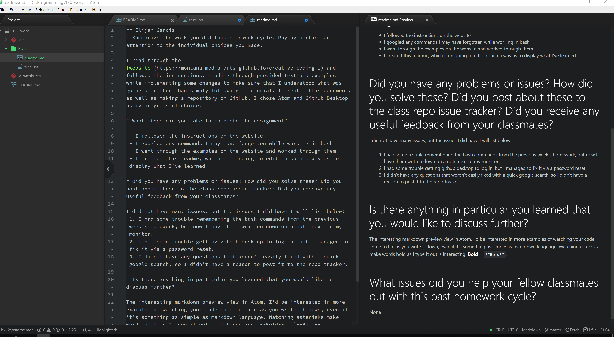

## Elijah Garcia
# Summarize the work you did this homework cycle. Paying particular attention to the individual choices you made.

I read through the [website](https://montana-media-arts.github.io/creative-coding-1) and followed the instructions, reading through provided text and examples while implementing some changes to make sure that I understood what was going on rather than simply following a tutorial. I created this document, as well as making a repository on GitHub. I chose Atom and Github Desktop as my programs of choice.

# What steps did you take to complete the assignment?

 - I followed the instructions on the website
 - I googled any commands I may have forgotten while working in bash
 - I went through the examples on the website and worked through them
 - I created this readme, which I am going to edit in such a way as to display what I've learned

# Did you have any problems or issues? How did you solve these? Did you post about these to the class repo issue tracker? Did you receive any useful feedback from your classmates?

I did not have many issues, but the issues I did have I will list below:
 1. I had some trouble remembering the bash commands from the previous week's homework, but now I have them written down on a note next to my monitor.
 2. I had some trouble getting github desktop to log in, but I managed to fix it via a password reset.
 3. I didn't have any questions that weren't easily fixed with a quick google search, so I didn't have a reason to post it to the repo tracker.

# Is there anything in particular you learned that you would like to discuss further?

The interesting markdown preview view in Atom, I'd be interested in more examples of watching your code come to life as you write it down, even if it's something as simple as markdown language. Watching asterisks make words bold as I type it out is interesting. **Bold** = `**Bold**`.

# What issues did you help your fellow classmates out with this past homework cycle?

None

### Here's the Editor Image

